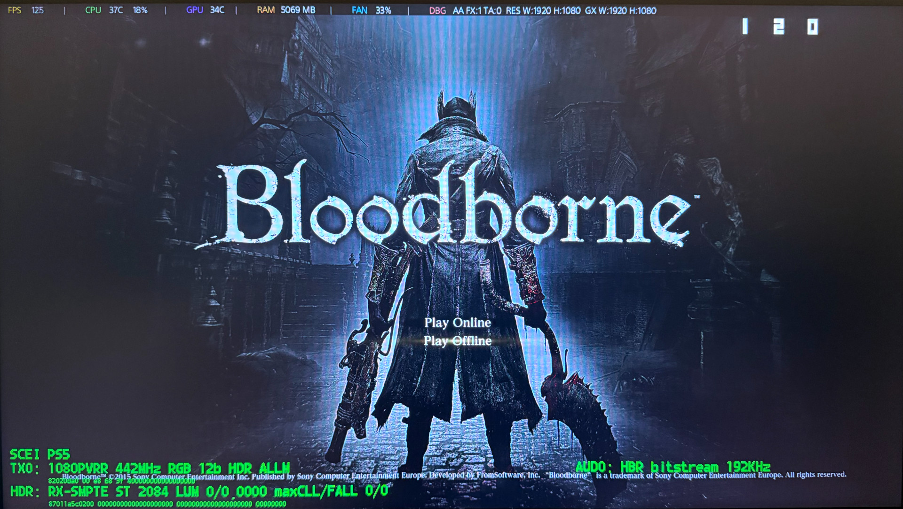
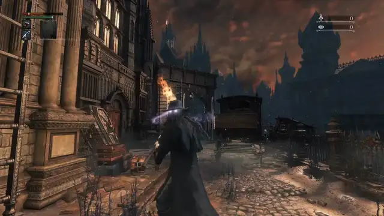

# Bloodborne PS5 mods

Image-quality and gameplay mods for **Bloodborne** (Game of the Year Edition, `CUSA03173`, v01.09) on a **jailbroken PS5**, delivered as **onionHEN cheats** that you switch on and off from the in-game cheat menu. No `eboot.bin` rewriting, no game files touched: the patches are applied to the running game at start-up.

Highlights: 60 FPS, no motion blur / chromatic aberration, sharper anti-aliasing, wide FOV, an experimental **first-person camera bolted to the character's head**, and (host tools, not a cheat) **VRR up to 120 Hz for PS4 games**.

*Bloodborne on a PS5 Pro at **120 Hz VRR** (1080p), photographed off the display: the onionHEN overlay (top left), the monitor's own counter (top right: 120) and the HDFury signal overlay in the HDMI path (bottom left: 1080p VRR, 442 MHz, RGB 12 bit, ALLM). The 120 Hz link comes from the optional host tools in [`tools/vrr`](tools/vrr/README.md), see [docs/vrr.md](docs/vrr.md).*

> **Read this first: tested on firmware 12.40 and a PS5 Pro only.**
> Everything here was developed and measured on a **PS5 Pro, system software 12.40**. Behaviour and performance on a **base PS5 (or Slim / Digital)** and on other firmware versions are **unknown** - the 60 FPS patch and anything that changes GPU/CPU load in particular may behave differently. Reports from other consoles are very welcome (see the issue templates). Use at your own risk, on a console and a game copy you own. This project is **not affiliated with or endorsed by** Sony Interactive Entertainment, FromSoftware, onionHEN or any other party named in [CREDITS.md](CREDITS.md). See [docs/compatibility.md](docs/compatibility.md).

*The experimental FPS head camera (PS5 Pro, `fps` profile): a fight in the first person view, then the death effect: when HP reaches 0 the view stays on the killer, "YOU DIED" arrives, and the characters drop to 5 % speed.*

**Feature site:** <https://alfaiotadev.github.io/bloodborne-ps5-mods/> (feature overview, side-by-side comparison tool, credits).

## What is included

| Cheat (name in the menu) | Default | Status | What it does |
|---|---|---|---|
| 60 FPS (Lance McDonald) | **on** | stable | Unlocks 60 FPS. Based on Lance McDonald's Bloodborne 1.09 60 FPS patch - see [CREDITS.md](CREDITS.md). |
| No Motion Blur | **on** | stable | Disables the motion-blur pass. |
| No Chromatic Aberration | **on** | stable | Disables the chromatic-aberration effect. |
| Skip Intro Logos | **on** | stable | Skips the start-up logo videos. |
| Wide FOV x1.3 | off | stable | Raises the field of view by 30 % (code patch, no per-frame cost). |
| DLAA threshold 0.3 | off | stable | The game already runs a DLAA pass; this raises its edge-detection threshold from 0.1 to 0.3, which measured and looked sharper (see the comparison tool on the site). |
| Anisotropic filtering 16x | off | works, little effect | Overrides the sampler table to 16x anisotropy. **No controlled test showed a visible difference** (even disabling anisotropy changed nothing in the test scenes); included for completeness. |
| No depth of field | off | works, scene-specific | Disables the depth-of-field pass. The effect is mild and depends on the scene (visible at far distances in one test scene, no difference in two Yharnam scenes). |
| FPS head camera (experimental) | off | experimental | First-person camera attached to the character's head bone (head bobbing, rolls, camera collision disabled, and a death camera that follows the head to the ground or looks at the killer, optionally in slow motion). **Double-click the touchpad to switch it on and off in game**; the field of view switches with it (x1.3 third person, x1.8 first person in the `_fps` profile). |
| FPS head camera: body faces the view | off (on in the `_fps` profile) | experimental | While the head camera is on, turns the displayed body to the camera direction (a more "tank-like" first-person feel). **Side effect: the coat/hood cloth disappears while it is on.** Back to normal in third person. Needs the head camera. |
| FPS head camera: aim at the lock-on target | off | experimental | While locked on, the first-person view looks at the target. Needs the head camera. |
| FPS head camera: death slow motion | off (on in the `_fps` profile) | experimental | GTA-style effect when HP reaches 0: the death plays at normal speed until the "YOU DIED" screen arrives, then every character drops to 5 % speed for about 6 seconds. Needs the head camera. |
| FPS head camera: look at the killer after death | off (on in the `_fps` profile) | experimental | From the moment of death the view stays on the enemy that killed you (the locked-on enemy, else the nearest living character) instead of tumbling with your head. Needs the head camera. |
| DLC Save Requirement Unlock | off | stable | Sets the DLC-ownership flags so that saves which require the DLC can be loaded. |

Details, numbers and the trade-offs of each mod: [docs/features.md](docs/features.md).

**Not a cheat: VRR for PS4 games, up to 120 Hz (host tools, new in 1.2.0).** [`tools/vrr`](tools/vrr/README.md) makes the console drive a VRR display while a PS4 game runs, which the built-in *Apply to Unsupported Games* option did not do for Bloodborne in the tested setup: **48-60 Hz** with a small script, or, with one extra patch, **1080p 119.88 Hz VRR (48-120 Hz)** so that the game can run well above 60 FPS with vsync on (100 FPS gave a flat 10.00 ms frame time in the tested setup). It needs the ps5debug payload and a host computer running Python scripts, writes into a system process (the 120 Hz patch writes **code**, see the safety notes) and keeps nothing after a restart. See [docs/vrr.md](docs/vrr.md) for results, limits and safety; tested on one game, one display, firmware 12.40, PS5 Pro.

## Install in three steps

1. Run a PS5 payload chain with the **patched onionHEN** from this repository on firmware 12.40 ([onionhen/](onionhen/); the prebuilt ELFs are attached to the [v1.1.0 release](https://github.com/alfaiotadev/bloodborne-ps5-mods/releases/tag/v1.1.0) and have not changed since; checksums in `onionhen/SHA1SUMS`). The patch adds what these cheats need: applying cheats at game launch, a safe code-cave allocator, execute-only page handling and the per-cheat `enabled` flag. Stock onionHEN lacks them and has **not** been tested with this cheat file.
2. Copy a cheat file to `/data/OnionHEN/cheats/CUSA03173_01.09.json` on the console (FTP): the safe default [`cheats/CUSA03173_01.09.json`](cheats/CUSA03173_01.09.json), or one of the ready-made **profiles** in [`cheats/profiles/`](cheats/profiles/) (`_quality`: FOV x1.3 + DLAA 0.3; `_fps`: that plus the experimental FPS head camera and lock-on aim, with FOV x1.8 while in first person). Rename the profile to `CUSA03173_01.09.json` when you copy it.
3. Start Bloodborne. The "on" mods above are applied at launch; open the onionHEN cheat menu to toggle the rest (the shortcut is set in onionHEN's `config.ini`, section `[shortcuts]`, key `cheats_menu`; for example hold **Options**).

Full guide, uninstall and troubleshooting: [docs/install.md](docs/install.md). Known problems: [docs/known-issues.md](docs/known-issues.md).

## How it works (short version)

The cheat file is a list of memory patches at fixed virtual addresses inside the game's `eboot.bin`. Small ones flip a few bytes (frame-rate cap, effects off). The larger ones - DLAA threshold, anisotropic filtering, the head camera - add **code caves**: a few hundred bytes of x86-64 placed in a spare RWX region, entered through a `jmp rel32` hook over an existing instruction. All of them are generated by readable Python in [`tools/mods/`](tools/mods/), so every byte in the JSON can be reproduced and audited. The research notes behind them (what was tried, what failed, the structures found) are in [`docs/research/`](docs/research/README.md).

## Repository map

| Path | Content |
|---|---|
| `cheats/` | The ready-to-use onionHEN cheat file for `CUSA03173` v01.09 (default) and ready-made profiles in `cheats/profiles/`. |
| `onionhen/` | The patch on top of upstream onionHEN (exec-time apply, screenshot hook, overlay, ...), build notes, checksums of the prebuilt ELFs (the ELFs themselves are on the Releases page). |
| `tools/mods/` | Generators that produce `cheats/*.json` (`build_cheats.py`) and the verification tools. |
| `tools/dev/` | Live-memory research and test tools (read/write the running game over ps5debug). |
| `tools/vrr/` | Host tools that enable VRR for PS4 games (48-60 Hz, or 119.88 Hz VRR with the optional patch) and cap Bloodborne's frame rate inside the VRR window ([docs/vrr.md](docs/vrr.md)). |
| `docs/` | Install guide, feature reference, known issues, compatibility, [research write-ups](docs/research/README.md) and [agent documentation](docs/agents/00-orientation.md). |
| `site/` | Source of the GitHub Pages feature site. |
| `AGENTS.md` | Entry point for AI coding agents that want to continue the work. |

## Releases and changelog

Prebuilt files and release notes are on the [Releases](https://github.com/alfaiotadev/bloodborne-ps5-mods/releases) page; what changed in each version is in [CHANGELOG.md](CHANGELOG.md).

## Contributing and continuing the work

Bug reports, test results from other consoles/firmware and new mods are welcome - use the issue templates. The repository is set up so that any capable LLM coding agent (or a human) can pick it up: start with [AGENTS.md](AGENTS.md). Open questions and ready-made first steps are listed in [docs/agents/90-open-questions.md](docs/agents/90-open-questions.md).

## Credits

This work stands on **Lance McDonald's 60 FPS patch**, on **onionHEN** and the PS5 payload community (etaHEN, GoldHEN, kstuff-lite, ps5-payload-dev, ps5debug, ...) and on many tools. The full list is in [CREDITS.md](CREDITS.md). The analysis and tooling were developed together with Claude (Anthropic) through Claude Code.

## License

[GPL-3.0](LICENSE) for the whole repository (the onionHEN patch is a derivative of a GPL-3.0 project). *Bloodborne* is a trademark of Sony Interactive Entertainment / FromSoftware; this repository contains no game assets, binaries or memory dumps.
